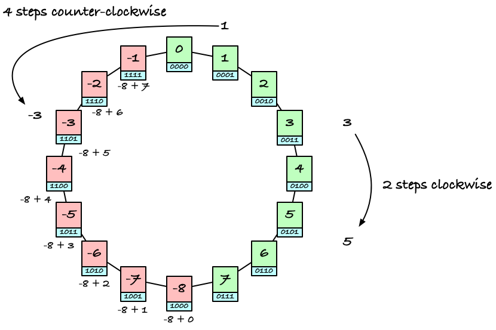
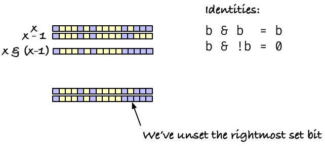
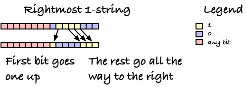

# Tips and tricks for manipulating bits

Despite popular conception, computer do not operate on ones and zeros. At least, it is a misleading idea. It is true that computers manipulate bits, but they do so in blocks of computer words, that are multi-bit binary numbers. If you want to manipulate numbers, the computer can readily do that, but if you want to manipulate individual bits, you have more work to do, and you have to do it by manipulating entire computer words.

This is still worthwhile to do in many cases. Bits are simple, and if you can manipulate all the bits in a word as single instructions, you can sometimes write faster code that you could otherwise do. If you can reduce artithmetic to simpler bit-wise operations, you can also gain some speed. These are, of course, micro-optimisations and not something you should focus on when developing algorithms, where larger-scale decisions are far more important, but if you need the extra little boost, you can often get it here. And sometimes, thinking in bits will actually give you better algorithms and data structures in the asymptotic sense as well, but that is beyond the scope of this little tutorial.

The purpose of this repository is just to show you have you can manipulate bits on a modern computer, and to show you some tricks that exploits this. I'll leave more complicated data structures and algorithms to other repos.

## Basic bit operations

Before we start, we should have an idea about how computers store information. At the basic level, you do not have the individual bit but some larger word size. If you use the common x86_64 architecture, for example, you can address data at a granularity of bytes, i.e. 8-bit numbers, but the CPU's registers are 64 bits, so that is typically the smallest data size you work with.

I am not going to use 64-bit words here, because they are unwieldy to draw and hard to read, so instead I will use 16-bit words. If you want 64-bit words, just extend them four times.

When we draw a word, we usually do it like this:


It has 16 bits, and we number them $b_0,b_1,\ldots,b_{15}$, and we number the right-to-left. That is the opposite of how we would write something like a string, where we typically write left-to-right in this culture, but it matches the way we write numbers. In decimal, you would write a number like 12 to mean 1 tens and 2 ones, with the most significant digit first and the least significant digit last. In binary, we do the same. We interpret a binary number 
$x = (b_0,b_1,\ldots,b_{15})$
as the number
$$x= b_{15}\cdot 2^{15} + b_{14}\cdot 2^{14} + \cdots + b_{1}\cdot 2^1 + b_0 \cdot 2^0 =  \sum_{i=0}^{15}b_i\cdot 2^i$$

Most of the time, if we just work with 16 bits, it doesn't matter which order they are in, but if we start shifting them left and right, we need to know which direction that is, and because we have this number interpretation, the most significant bit is the left-most and the least significant bit is the right-most.

The basic operations you can do with individual bits are those you know from boolean logic. Here, we interpret bits as truth-values, with 1 being true and 0 being false, and the operations are

 * `NOT b`: true if b is false, false if b is true
 * `a AND b`: true if both a and b are true, false otherwise
 * `a OR b`: true if either of a or b are true, false otherwise
 * `a XOR b`: true if exactly one of a or b are true, false otherwise

The rules are the same when you use these operations on a computer word. There, you just apply the rule to all the operation in one or two words in parallel.


Other operations work on the entire word, but still bit-wise. The most important are shift operations, and I will only present those here, and leave others for later tricks.

When you shift words left or right, usually written as `x << k` or `x >> k` for shifting the word `x` left or right by `k` bits, you get exactly what it says on the tin: you shift all the bits in the word `k` places to the left or right.

The left shift is the simplest, because there are only one version of it. It will shift bits to the right, the bits it shifts out of the edge of the word are lost[^1] and the bits that are left at the right are set to zero, as if we had shifted zero bits in from some even lower index bits.


With the way we interpret bit-patterns as binary numbers, a left shift corresponds to multiplying by a factor $2^k$ but modulo the size of your words. If the word is

$$x= b_{15}\cdot 2^{15} + b_{14}\cdot 2^{14} + \cdots + b_{1}\cdot 2^1 + b_0 \cdot 2^0 = \sum_{i=0}^{15}b_i\cdot 2^i$$

then shifting, ignoring overflow (the bits that are dropped on the left) we get

$$x \ll 3  = b_{15}\cdot 2^{18} + b_{14}\cdot 2^{17} + \cdots + b_{1}\cdot 2^4 + b_0 \cdot 2^3 = \sum_{i=0}^{15}b_i\cdot 2^{i+3} = 2^3\cdot\sum_{i=0}^{15}b_i\cdot 2^i = 2^3 x$$

and chopping off the contributions that go beyond the available word-size, bits $2^{18}, 2^{17}, 2^{16}$, corresponds to taking the remainder with respect to 
$2^{16}$.

Shifting bits doesn't require complicated hardware, not compared to multiplication, so multiplying by factors of two is much faster done by left-shifting. Your compiler will automatically do that, if it knows it is a power of two it is multiplying with. Hardware will also sometimes figure it out, but there you are usually safer to translate to bit operations if you need it. But this is a micro-optimisation that is rarely worth it; figure out a way to let the compiler know what you are multiplying with instead, if you can.

Shifting right does the same thing, it moves the bits to the right, but there is a complication with what it shifts in from the left. The simple solution is to shift in zeros just as left-shift does, and that is one option. It is called *logical right-shift* (but not really because it is the "logical" choice, but because it considers the bits as independent boolean values).


This operation is analogue to left-shift, and if you interpret the bits as a number the way we have above, which is an *unsigned* number, then it behaves like a division by a power of two. This is because the number interpretation is such that we multiply the magnitude by two every time we go one bit up and we divide by two every time we go one bit down. So dividing by a multiple of twos amounts to shifting the high bits down. If you extract the low bits instead, incidentally, you will get the remainder of that division. You can do that with a mask (a bit pattern) that you AND with. We will see how to create masks later.


However, if you interpret the bit pattern as a signed integer, you might have negative numbers, and those are not encoded the same way. They are encoded in two's complement on all modern computers, and we look at that shortly. Suffices to say here is that if you want to interpret a shift of such a number as a division, then the highest bit is what you must shift in on the left. So if the highest bit is zero, we get the same as logical shift, but if the highest bit is one, we get one-bits shifted in instead. This type of shift is called *arithmetic shift* because it adapts to the number interpretation of the bit pattern.


There's a couple of issues if you use shifting in your code. One is that you do not always control whether you use logical or arithmetic shift. All languages I know of, that have unsigned integer types, will use logical shift on those. But if you have signed integers, you need to check with your language. Some languages have separate operators for logical and arithmetic shift, `>>>` for logical and `>>` for arithemtic shift in Java, for example. Or they will use arithmetic shift for signed types and logical for unsigned. Or, as in with the every complicated C programming language, leave it undefined--you might get one, you might get the other, and we are not going to tell you.

Another issue is the offset `k` we shift with. Since zeros (or maybe ones with arithmetic shift) are shifted in, you might think that you can shift by an arbitrary amount. Think again. The hardware instructions for shifting generally require a small number that can be encoded in machine code, and they don't necessarily accept shifts larger than the word size. (In C, it is of course undefined what happens if you shift by more than the word size; Rust is better, here it is a compile time error to even attempt). So keep `k` smaller than the word size if you want to live a long and happy programmer life. There are times where this is annoying, and you at least would want to shift a 32-bit word by 32 bits and just let the result be all zeros, for example, but then you have to program your way around that.

### Using the operators

Before we go to the next section, let's see how we can perform these operations in a  programming language. I've chosen Rust because it is a reasonable low-level langauge, and the operations we have on bits here we probably have everywhere, but at the same time it is more strict in its definition compared to a language such as C, were some operations are left undefined by the language standard. What we can do in one language, though, we can usually do in all of them, except that the syntax for the operations can be different. (The bit-wise negation, `NOT` above, is `!` in Rust, for example, but it is `^` in Go and `~` in most other languages I know (that do not use `~` as a unary minus)).

A word of warning if you are using Python, though: there you don't have fixed sized words, and that changes many of the operations. You cannot shift bits off the left end of a word, for example, and some operations are less straightforward. If you want to manipulate bits in Python, you need to read the documentation there.


The bit operators in Rust are:
 * NOT: `!`
 * OR: `|`
 * AND: `&`
 * XOR: `^`
 * SHIFT: `<<` and `>>`. The right shift is logical for unsigned integers and arithmetic for signed.

You can see the operations in action in these code snippets:

```rust
    let x: u16 = 0xf4e2; // [f: 1111, 4: 0010, e: 1110, 2: 0010]
    println!("Unsigned:");
    println!("x:                      {:016b}", x);
    println!("!x:                     {:016b}", !x);
    println!("");
```

```
Unsigned:
x:                      1111010011100010
!x:                     0000101100011101
```


```rust
    println!("x:                      {:016b}", x);
    println!("x << 2:                 {:016b}", x << 2);
    println!("x | (x << 2):           {:016b}", x | (x << 2));
    println!("");
```

```
x:                      1111010011100010
x << 2:                 1101001110001000
x | (x << 2):           1111011111101010
```

```rust
    println!("x:                      {:016b}", x);
    println!("x << 2:                 {:016b}", x << 2);
    println!("x ^ (x << 2):           {:016b}", x ^ (x << 2));
    println!("");
```

```
x:                      1111010011100010
x << 2:                 1101001110001000
x ^ (x << 2):           0010011101101010
```

```rust
    println!("x:                      {:016b}", x);
    println!("x >> 2:                 {:016b}", x >> 2);
    println!("x & (x >> 2):           {:016b}", x & (x >> 2));
    println!("");
```

```
x:                      1111010011100010
x >> 2:                 0011110100111000
x & (x >> 2):           0011010000100000
```

Notice that the right-shift pulls zeros in from the left. That will change if we use a signed integer instead:


```rust
    #[allow(overflowing_literals)] // so we can cast the bit-pattern 0xf4e2 to i16
    let x: i16 = 0xf4e2 as i16; // [f: 1111, 4: 0010, e: 1110, 2: 0010]
    println!("Signed:");
    println!("x:                      {:016b}", x);      // same bit-pattern as before
    println!("x << 2:                 {:016b}", x << 2); // left-shift the same
    println!("x >> 2:                 {:016b}", x >> 2); // arithmetic shift
```

```
Signed:
x:                      1111010011100010
x << 2:                 1101001110001000
x >> 2:                 1111110100111000
```

As you can see, this right-shift drags ones in from the left. This is because it is an arithmetic shift and there was a one in the most-significant bit before the shift. When we shifted the same bit-pattern earlier, but in an unsigned integer, we shifted zero bits in; that was logical shift.

## Unsigned arithmetic

With the interpretation of binary numbers we have above, where we consider the bits as coefficients for increasing powers of two, arithmetic works as you would expect it from your elementary school math lessons, except that there are only a finite number of bits to work with.

### Addition

If you add two numbers, you add them from least-signficant bit to most-significant bit, with carries where necessary. For two 8-bit words, it could look like this:

```
       57 =   00111001
    + 111 = + 01101111

    carry:         1
       57:   00111001
      111: + 01101111
                    0
    
    carry:        1
       57:   00111001
      111: + 01101111
                   00

    carry:       1
       57:   00111001
      111: + 01101111
                  000

    carry:     1
       57:   00111001
      111: + 01101111
                01000

    carry:    1
       57:   00111001
      111: + 01101111
               101000

    carry:   1
       57:   00111001
      111: + 01101111
              0101000

    carry:  0
       57:   00111001
      111: + 01101111
             10101000

       168 = 10101000
```

If you run out of bits, though, say you want to add 128 + 128 in 8 bits, you can't represent the result.

```
      128:   10000000
      128: + 10000000
      =     100000000 <- requires 9 bits
```

What happens then depend on your programming language and/or the hardware you work on. For unsigned values, the typical behaviour is that any extra bits are just droped, which means that 128 + 128 equals zero in unsigned 8-bit words. This has the straightforward interpretation that you are doing arithmetic in the ring $x\mod 2^{\mathrm{ws}}$ when you work with words of size `ws`. 

$$128 + 128 \mod 2^8 = 256 \mod 2^8 = 0 \mod 2^8$$

Your CPU will have registers to indicate that you had an overflow, but they are not available in high-level langauges (not even in low-level languages such as C). Sometimes, this is the behaviour you want, but more often it is an error. Typically, though, it is not something you will be informed about by your programming envirnonment, and you need to check it explicitly. In Rust, overflow is a runtime error *when you compile in debug mode*,[^4] but it is silently ignored in development mode. In C, unsigned arithmetic is always to ignore overflow when variables are signed, but left undefined (just one tad worse than silently ignoring errors) when you use signed integers. Generally, overflow is something you have to worry about if you do arithmetic and there is a risk of them occurring, because you are unlikely to be told about them. What happens, is up to your langauge and system.

### Subtraction

Subtraction also works the way you would expect, just with a borrow instead of a carry.

```
     102 =   01100110
   -  67 = - 01000011
      35 =   00100011

   borrow:          2
      102:   01100100
       67:   01000011
                    1

   borrow:         2  
      102:   01100000
       67:   01000011
                   11

   borrow:           
      102:   01100000
       67:   01000011
                  011

   borrow:           
      102:   01100000
       67:   01000011
                 0011

   borrow:           
      102:   01100000
       67:   01000011
                00011

   borrow:           
      102:   01100000
       67:   01000011
               100011

   borrow:           
      102:   01100000
       67:   01000011
              0100011

   borrow:           
      102:   01100000
       67:   01000011
             00100011
```

What happens if we subtract a larger number from a smaller, though? We should get a negative number, (with 67 - 102 we would expect -35), but we don't *have* negative numbers with the current representation, and we won't have them until the next section. Let's try to just subtract like before, but when we need to borrow and there aren't any numbers left, we will borrow from off the left edge of the numbers. That is where extra bits went with overflow before, so let's try to get them back from the same place here:

```
   borrow:          
       67:   01000011
      102:   01100100
                    1

   borrow:          
       67:   01000011
      102:   01100100
                   11

   borrow:        2  
       67:   00111011
      102:   01100100
                  111

   borrow:          
       67:   00111011
      102:   01100100
                 1111

   borrow:          
       67:   00111011
      102:   01100100
                11111

   borrow:          
       67:   00111011
      102:   01100100
               011111

   borrow:    2    <- you borrowed from off the edge
       67:   10111011
      102:   01100100
              1011111

   borrow:
       67:   10111011
      102:   01100100
    = 221:   11011111
```

The number we get is 221, which looks odd, but

$$221 \mod 2^8 = -35 \mod 2^8$$

so we get the same modulus arithmetic as before.

What actually happens will again depend on your language and system. When we need to borrow from off the edge of the word we have an overflow, and that can be silently ignored, be an error, or be any other number of things. You need to check the documentation for your langauge to know exactly what would happen.

## Multiplication and division

I won't go into much detail with how multiplication and division work, because it is complicated on the hardware, but the effect is what you would be used to here as well. If you multiply two words, `w * v`, it will amount to adding `w` to `w` `v` times

```
    w  = 67  = 01000011
             + 01000011
   2w = 134  = 10000110
             + 01000011
   3w = 201 =  11001001
```

If you can do long division with decimal numbers, you can do the same with binary numbers

```

    201 / 3

 201 = 11001001
   3 = 00000011

      01
 11 ) 11001001
      11
      --
       00


      010
 11 ) 11001001
      11
      --
       00
       00
       --
        00


      0100
 11 ) 11001001
      11
      --
       00
       00
       --
        00
        00
        --
         01


      01000
 11 ) 11001001
      11
      --
       00
       00
       --
        00
        00
        --
         01
         00
         --
          10


      010000
 11 ) 11001001
      11
      --
       00
       00
       --
        00
        00
        --
         01
         00
         --
          10
          10
          --
          100


      0100001
 11 ) 11001001
      11
      --
       00
       00
       --
        00
        00
        --
         01
         00
         --
          10
          10
          --
          100
           11
           --
            11

      01000011
 11 ) 11001001
      11
      --
       00
       00
       --
        00
        00
        --
         01
         00
         --
          10
          10
          --
          100
           11
           --
            11
            11
            --
             0


    11001001 / 00000011 = 01000011
         201 /        3 =       67
```

Multiplication can give you overflow, and division is integer division, so if there is a remainder, you need another operator to get that (it is typically `%` instead of `/`, but it depends on your language).


## Two's complement arithmetic

The interpretation of bit-patterns as numbers we saw earlier

$$x = \sum_{i=0}^{15}b_i\cdot 2^i$$

only works for non-negative numbers. It only tells us a magnitude (the absolute value) of the number. To also allow for negative numbers, [we need to add something](https://en.wikipedia.org/wiki/Signed_number_representations). One possibility is to set asside one of the bits, a so-called *sign bit*, to indicate whether the number should be considered positive or negative. Floating point numbers do this. This has some drawbacks, most noticeable that you get two zeros, which complicates many computer instructures that rely on checks for zero.[^2] The hardware manipulation of numbers with a sign bit is also more complicated, since the sign bit determines what something like `x + y` should be; if one or both of the number are negative, the hardware logic should treat the addition differently from if they are both positive.

All modern hardware now use the [two's-complement representation](https://en.wikipedia.org/wiki/Two's_complement).[^3] There, the highest bit has a different interpretation: it contributes a value that is minus two to the word-size minus one, so for a 16-bit word in two's complement, the bits are interpreted as

$$x = \sum_{i=0}^{14}b_i\cdot 2^i - b_{15}2^{15}$$

With this interpretation, the high bit indicates whether we should interpret a bit-pattern as a positive or negative number, just as if it were a sign-bit, but it doesn't function exactly like a sign bit. There is still only one zero, which we get if all the bits are zero. If we set all except the high bit to zero, we would not get zero but a negative number, $-b_{15}2^{15}$.

For the example below, I use 4-bit words (because 8-bit would be too long), and I run through all the bit patterns twice, showing the unsigned interpretation on the left and the two's-complement signed pattern on the right.

```
Unsigned 4-bit    Signed 4-bit
                  * -2**3  Rest  = 
0000 =  0         0        000   =  0 - 0*8 =  0
0001 =  1         0        001   =  1 - 0*8 =  1
0010 =  2         0        010   =  2 - 0*8 =  2
0011 =  3         0        011   =  3 - 0*8 =  3
0100 =  4         0        100   =  4 - 0*8 =  4
0101 =  5         0        101   =  5 - 0*8 =  5
0110 =  6         0        110   =  6 - 0*8 =  6
0111 =  7         0        111   =  7 - 0*8 =  7
1000 =  8         1        000   =  0 - 1*8 = -8
1001 =  9         1        001   =  1 - 1*8 = -7
1010 = 10         1        010   =  2 - 1*8 = -6
1011 = 11         1        011   =  3 - 1*8 = -5
1100 = 12         1        100   =  4 - 1*8 = -4
1101 = 13         1        101   =  5 - 1*8 = -3
1110 = 14         1        110   =  6 - 1*8 = -2
1111 = 15         1        111   =  7 - 1*8 = -1
0000 =  0         0        000   =  0 - 0*8 =  0
0001 =  1         0        001   =  1 - 0*8 =  1
0010 =  2         0        010   =  2 - 0*8 =  2
0011 =  3         0        011   =  3 - 0*8 =  3
0100 =  4         0        100   =  4 - 0*8 =  4
0101 =  5         0        101   =  5 - 0*8 =  5
0110 =  6         0        110   =  6 - 0*8 =  6
0111 =  7         0        111   =  7 - 0*8 =  7
1000 =  8         1        000   =  0 - 1*8 = -8
1001 =  9         1        001   =  1 - 1*8 = -7
1010 = 10         1        010   =  2 - 1*8 = -6
1011 = 11         1        011   =  3 - 1*8 = -5
1100 = 12         1        100   =  4 - 1*8 = -4
1101 = 13         1        101   =  5 - 1*8 = -3
1110 = 14         1        110   =  6 - 1*8 = -2
1111 = 15         1        111   =  7 - 1*8 = -1
```

The reason I wrote all the numbers twice is that I wanted you to think about the arithmetic with the overflow behaviour, i.e., arithmetic modulus $2^\mathrm{ws}$. If we consider the unsigned numbers, this means that we are moving around a circle of positive numbers. Adding two numbers `x + y` means moving from the number `x` and `y` steps clockwise, subtracting `x - y` means moving from `x` by `y` steps counter-clockwise.


If we reinterpret the modulus circle with two's complement, the addition and subtraction works the same way: addition means moving a number of steps clockwise and subtraction moving a number of steps counter-clockwise.



With modulus arithmetic, it is just a question of which number we use to represent the modulus class. With unsigned numbers, we use the numbers `0, 1, 2, ..., 15`, but with two's complement, we use negative numbers for the latter half of the classes.


Notice that this means that we have one more negative number than positive. On the figures, I've painted zero green, so zero is lumped together with the positive numbers. There are an equal number of red and green, but one of the green is zero while the rest are positive numbers, while all of the red are negative numbers.


In other words, the smallest possible negative number in a finite number of bits, when we interpret them as two's-complement numbers, does not have a corresponding positive number.

You might now wonder if there is a simple way to translate the bit-pattern of a positive number $x$ into the corresponding
negative number, $-x$. There is: you negate the bits
in $x$
to get $\neg x$, and then you add one

$$-x = \neg x + 1.$$


This doesn't just work for changing positive numbers into negative but also for changing negative numbers into positive


with the caveat that if you try to change the smallest negative number into the corresponding positive number, which as you now know doesn't exit, you end up with the smallest negative number again.


There are several nice properties about this representation. One of them is that we don't need special logical to add positive and negative numbers. If we treat all numbers as unsigned and add them with overflow, then we also handle signed addition if we instead interpret the numbers that way.

```
Signed:
  100 = 01100100
+ 130 = 10000010
----------------
  230 = 11100110
================

Unsigned:
   100 = 01100100
+ -126 = 10000010
-----------------
   -26 = 11100110
=================
```

The bit addition is the same in the two examples, we just interpret the first as arithmetic in unsigned binary numbers and the second as arithmetic in two's-complement.

The second example also shows another nice property of two's-complement: if you want to do subtraction, $x - y$, then you can just change the sign of
$y$ and do addition,
$x - y = x + (-y)$. This shouldn't be surprising from your knowledge of arithmetic, but it works perfectly with the bit patterns as well, if you use two's complement: first you change the sign and then you add as if there were no such thing as signed integers.

The reason we have an arithmetic shift operator is because we have two's-complement integers. Dividing by powers of two is easy and efficiently done with right-shifting, but if we always shift in zero-bits, it would only work for unsigned values.

If we take a positive number and divide it by a power of two, we get what amounts to a shift to the rigth. (Of course, we usually think about it the other way around; we use shifts to divide).

```
64               = 01000000
64 / 4 = 64 >> 2 = 00010000 = 16
```

But if we take a negative number, and implement division of a power of two with a shift, we won't get the right answer:

```
-64                = 11000000
-64 / 4 = -64 >> 2 = 00110000 = 48
```

We *almost* get the right answer; the answer we get is the positive number the matches the negative number we wanted on the modulus circle, but it isn't the number we wanted.

If instead we use arithemetic shift, we maintain the sign bit on the number, and draggint ones in from the left ensures us that we get the bit-pattern for the right negative number.

```
-64                = 11000000
-64 / 4 = -64 >> 2 = 11110000 = -16
```

To see why this works, consider the two's-complement interpretation of a bit pattern once more:

$$x = -b_{w-1}2^{w-1} + \sum_{i=0}^{w-2} b_i\cdot 2^i$$

If we have a negative number (you can check for positive numbers yourself), then the first bit is set, so it contributes a value of $-2^{w-1}$ and the rest sum to some positive contribution.

$$x = -2^{w-1} + \sum_{i=0}^{w-2} b_i\cdot 2^i$$

If we just treat this as basic arithmetic, we can divide by two through all the terms, and we will see that this amounts to an arithmetic shift. If one shift divides by two, then doing it $k$ times will amount to shifting
$k$ times, and if one time amounts to dividing by two, then
$k$ times amounts to dividing by
$2^k$.

Dividing all terms by two we get:

$$x/2 = -2^{w-2} + \sum_{i=0}^{w-2} b_i\cdot 2^{i-1}
      = -2^{w-2} + \sum_{i=0}^{w-3} b_{i+1}\cdot 2^i + b_0/2$$

and remember that a negative number such as $-2^{w-2}$ is represented in two's-complement as

$$-2^{w-2} = -2^{w-1} + 2^{w-2}$$

That means that dividing by two gives us the equation

$$x/2 = -2^{w-1} + 2^{w-2} + \sum_{i=0}^{w-3} b_{i+1}\cdot 2^i + b_0/2.$$

We now have the two highest bit set, and all the other bits contribute half as much as before, i.e., they are shifted right by one.

If the lowest bit, $b_0$, is zero, this is a division by two. But what happens if we cannot divide
$x$ exactly? What if
$b_0=1$?
We cannot represent fractions with this representation, so we are doing integer division, but is that what we are getting?

When we shift, the low bit(s) that are shifted off the edge of the word are thrown away, so in the expression above $b_0/2$ means zero. If we had a positive number, throwing away the half-bit would round the result down towards zero, which is what integer division does.

But if we throw away the positive contribution $b_0/2$ from the sum, we are not rounding up towards zero; instead we are rounding down.

$$-2^{w-1} + 2^{w-2} + \sum_{i=0}^{w-3} b_{i+1}\cdot 2^i < -2^{w-1} + 2^{w-2} + \sum_{i=0}^{w-3} b_{i+1}\cdot 2^i + b_0/2$$

so we are rounding down towords minus infinity. In this sense, arithmetic shift is *not* like division. It is only division if there is no remainder; if there is a remainder, it rounds in the wrong direction.

Another clear example of this is dividing -1 by two. We would expect -1/2 = 0 for integer division, but if you shift -1, the bit pattern that consists of all ones, an arithmetic shift would give us -1 back.

```
  11111111 >> 1 = 11111111
```

When you shift right, you still get multiplication by powers of two. Consider the two's-complement interpretation of a number, and multiply the number by two:

$$2\times\left(-b_{w-1}\cdot 2^{w-1} + \sum_{i=0}^{w-2} b_i\cdot 2^i\right)
=-b_{w-1}\cdot 2^w + \sum_{i=0}^{w-2} b_i\cdot 2^{i+1}$$

If we have a positive number $b_{w-1}$ is zero, and we have increased each bit's contribution by a factor two, amounting to shifting them one position to the right.

If we have a negative number we have

$$-b_{w-1}\cdot 2^w + \sum_{i=0}^{w-2} b_i\cdot 2^{i+1}
= -2^w + b_{w-2}\cdot 2^{w-1} + \sum_{i=1}^{w-2} b_{i-1}\cdot 2^i + 0\cdot 2^0$$

which, since $-2^w = -2^{w-1} - 2^{w-2}$ is

$$-2^{w-1} + (b_{w-2} - 1)\cdot 2^{w-1} + \sum_{i=1}^{w-2} b_{i-1}\cdot 2^i + 0\cdot 2^0.$$

I know we don't have two bit-locations for $w-1$, but we don't have one for
$w$ either, so at this point we don't have a valid bit pattern, but we are just doing arithmetic on numbers.

If the new highest bit, $b_{w-2}$, is a one, then the second term cancels and we have the number

$$-2^{w-1} + \sum_{i=1}^{w-2} b_{i-1}\cdot 2^i + 0\cdot 2^0.$$

where the remaining bits all have a magnitude that is a factor of two higher, i.e., they are shifted left, and we have shifted a zero into the least significant position. In other words, if we shift a one into the left-most bit, a shift and a multiplication by two is the same.

```
 -1 = 1111
 -1 << 1 = 1110 = -2
 -2 = 1110
 -2 << 1 = 1100 = -4
 -3 = 1101
 -3 << 1 = 1010 = -6
 -4 = 1100
 -4 << 1 = 1000 = -8
```

If the new left-most bit is zero, on the other hand, we have

$$-2^{w-1} + (b_{w-2} - 1)\cdot 2^{w-1} + \sum_{i=1}^{w-2} b_{i-1}\cdot 2^i + 0\cdot 2^0
= -2^{w-1} - 2^{w-1} + \sum_{i=1}^{w-2} b_{i-1}\cdot 2^i + 0\cdot 2^0$$

which, since $-2^{w-1} - 2^{w-1} = 2\times\left(-2^{w-1}\right) = -2^w$, is

$$-2^{w} + \sum_{i=1}^{w-2} b_{i-1}\cdot 2^i + 0\cdot 2^0$$

where we can't represent $-2^{w}$ in a
$w$-bit word, so it is dropped, leaving

$$\sum_{i=1}^{w-2} b_{i-1}\cdot 2^i + 0\cdot 2^0$$

We have an overflow, where we are now missing $-2^w$. So we get a number that, if we subtracted
$2^w$ from it, would be the right result.

```
 -5 = 1011
 -5 << 1 = 0110 = 6 (-2**4 = -10)
 -6 = 1010
 -6 << 1 = 0100 = 4 (-2**4 = -12)
 -7 = 1001
 -7 << 1 = 0010 = 2 (-2**4 = -14)
 -8 = 1000
 -8 << 1 = 0000 = 0 (-2**4 = -16)
```

Overflows are not unique to two's-complement numbers. If you shift bits off the end, you move past the range of numbers you can represent, and you are doing arithemtics in the ring $\mod 2^w$ instead of the integers. That is just a consequence of working with fixed-sized words. At least the signed and unsigned integers work roughly the same when it comes to multiplication of powers of two and shifting bits to the left...

If this all seems a bit overwheling by now, have no fear. You rarely have to think too much about two's-complement arithmetic to exploit bit-manipulation for tricks. The only thing you *really* need to know about two's-complement is the equation $-x = \neg x + 1$. That comes in handy from time to time, especially if you want to translate boolean values into bit masks. This is because boolean values are often represented as the numbers 0 for false and 1 for true, or the bit-patterns `000....000` and `000...001`, but often you would rather have bit masks `000...000` and `111...111` (all zeros or all ones). That is, if you have a boolean value `b` but you want a mask `m` such that

```
 b = 0000 -> m = 0000
 b = 0001 -> m = 1111
```

You can do that in several ways. If you have arithmetic shift, you could shift `b` `w-1` to the left and then `w-1` to the right:

```
0000 << 3 = 0000, 0000 >> 3 = 0000
0001 << 3 = 1000, 1000 >> 3 = 1111
```

(but this only works with arithmetic shift and not logical shift).

You could shift and OR a couple of time (doubling the shift each time, so a $\log w$ number of times):

```
0000 | (0000 << 1) = 0000
0000 | (0000 << 2) = 0000

0001 | (0001 << 1) = 0011
0011 | (0011 << 2) = 1111
```

but by far the easiest way, and only one hardware instruction, is to change the sign of `b`:

```
b = 0000; -b = 0000 (~0000 + 1 = 1111 + 1 = 0000 (with overflow))
b = 0001; -b = 1111 (~0001 + 1 = 1110 + 1 = 1111)
```


## A bag of bit-tricks

That was the basic theory. The most fundamental bit-operations, and how we treat bit-patterns as numbers, both signed and unsigned, on modern computers. From here on, it is just a long list of various tricks you can use for manipulating computer words with bit operations. If you think of more, please make a pull request. It is always fun to have a large catalogue of clever ideas.

### Getting and setting bits

Perhaps the most fundamental task we could think of is getting an individual bit from a word. To do that, shift a one in under the bit and mask with `&`. If you want bit `i`, then you do `x & (1 << i)`. It gives you a new word where bit `i` has the same value as `x[i]`, and all remaining bits zero.

```
x            = 01111101
1 << 0       = 00000001
x & (1 << 0) = 00000001

x            = 01111101
1 << 1       = 00000010
x & (1 << 1) = 00000000

x            = 01111101
1 << 2       = 00000100
x & (1 << 2) = 00000100

x            = 01111101
1 << 3       = 00001000
x & (1 << 3) = 00001000
```

In Rust it could look like this (for eight-bit words):

```rust
fn get(x: u8, i: u8) -> u8 {
    x & (1 << i)
}
```

If you want to interpret the result as a boolean value, there are two issues. The first is how hardware generally interpret bit-patterns as truth-values. Most hardware instructions consider the bit pattern with all zeros to be false and anything else to be true. Many programming langauges do the same, considering anything "zero-like" (empty lists or strings, the number zero, etc.) to mean false and anything else to mean true. This is sometimes called [truthiness](https://en.wikipedia.org/wiki/Truthiness) after The Colbert Report. If you in such a language, an integer can already be used as a truth(y) value, and you don't have to do anything more to interpret the bit pattern you get from `x & (1 << i)`.

Some languages are more strict about their type system, though, and do not consider any type of integer a boolean value. If so, you can easily translate the integer the bit manipulations are making into a boolean value; just compare the result with zero. If the bit pattern `x & (1 << i)` is zero (which we should interpret as false), then `x & (1 << i) != 0` is false, while if `x & (1 << i)` is non-zero, `x & (1 << i) != 0` is true. Comparing with zero has the effect of telling the type system that any non-zero value should be `true` and only zero should be `false`.

```rust
fn get_bool(x: u8, i: u8) -> bool {
    (x & (1 << i)) != 0
}
```

The extra comparsion is not necessarily anything you pay for. The compiler can figure out that you just want a truth-value out of an integer, and it can usually make something useful out of that. [It can actually be slightly more efficient](https://godbolt.org/z/7WhbPToT8), since we ask for simpler output, so in the linked-to example, the assembly code for the boolean version directly compares the bit and sets the result to `00000000` or `00000001` based on the comparison.

If you wanted to translate the bit lookup into zero or one, `00000000` or `00000001`, you could also have done this:

```rust
fn get_zero_one(x: u8, i: u8) -> u8 {
    (x >> i) & 1
}
```

If your language represents true and false as zero and one (when working with bools and not some truthiness) casting a boolean value to an integer would also give you zero or one, so `get_zero_one(x, i)` will give you the same as `get_bool(x, i) as u8`.

Now let's say you have a word `x` and you want to set the i'th bit to one, that is, you want a new word `y` where `y[i] = 1` and `y[j] = x[j]` everywhere else.

To do that, shift a one-bit up to position `i` with `1 << i` and then OR it with `x`.

```
x            = 01111101
1 << 0       = 00000001
x | (1 << 0) = 01111101

x            = 01111101
1 << 1       = 00000010
x | (1 << 1) = 01111111

x            = 01111101
1 << 2       = 00000100
x | (1 << 2) = 01111101

x            = 01111101
1 << 3       = 00001000
x | (1 << 3) = 01111101
```

In Rust:

```rust
fn set_bit(x: u8, i: u8) -> u8 {
    x | (1 << i)
}
```

If you instead want to clear the bit, so `y[i] = 0` and `y[j] = x[j]` everywhere else, you can shift a one up to position `i` with `1 << i` once more, but now flip all the bits to get ones everywhere *except* position `i`: `!(1 << i)`. If you AND this with `x`, position `i` is set to zero, because whatever `x[i]` is we are AND'ing with zero, and all the other bits remaint he same, because we AND `x[j]` with 1.

```
x             = 01111101
!(1 << 0)     = 11111110
x & !(1 << 0) = 01111100

x             = 01111101
!(1 << 1)     = 11111101
x & !(1 << 1) = 01111101

x             = 01111101
!(1 << 2)     = 11111011
x & !(1 << 2) = 01111001

x             = 01111101
!(1 << 3)     = 11110111
x & !(1 << 3) = 01110101
```

In Rust, for eight-bit words:

```rust
fn clear_bit(x: u8, i: u8) -> u8 {
    x & !(1 << i)
}
```


### Bit-masks

Getting and setting individual bits is generally useful, but sometimes we want to manipulate larger chunks of contiguous bits. For that, we also use shift, OR, and AND, but just with larger blocks, called *masks*.

Before we start constructing masks, there is an observation we need to make. If you have a bit pattern `x` and you subtract 1 from it, the rightmost one-bit (if there is one) gets flipped to zero while the bits lower than that are flipped to one, and if there isn't any set bits, then `x - 1 = -x` (because `0 - 1 = -1`) which are all set bits.

```
x         = 00000000
x - 1     = 11111111

x         = 00001101
x - 1     = 00001100

x         = 00001110
x - 1     = 00001101

x         = 00001111
x - 1     = 00001110

x         = 00010000
x - 1     = 00001111
```

This is just a consequence of how subtraction with borrowing works; we borrow from the right-most 1 all the way down to position zero in order to subtract one. The case where `x` is the same thing, but in arithmetic modulo $2^w$.

Depending on how anal the type checker in your langauge is, you might have to cast between signed and unsigned to subtract with overflow, which happens for `x = 0`, but in Rust it looks like this:

```rust
fn minus_one(x: u8) -> u8 {
    (x as i8 - 1) as u8
}
```

It is only necessary for `x = 0` where `x - 1` gives an overflow; if we knew `x > 0` we could stay in `u8` the entire time.

We can use this to get a contiguous range of set bits that we can use as a mask. If you want to extract the last `k` bits from a word, you want to set those `k` bits to one and everything else to zero. So make a word with one bit at position `k` (since we index from zero, that is one bit to the left of where you want your mask to start) and then subtract one from it. The one-bit word you can make by shifting one left by `k`.

```
1 << 0 = 00000001
mask   = 00000000

1 << 2 = 00000100
mask   = 00000011

1 << 3 = 00001000
mask   = 00000111

1 << 4 = 00010000
mask   = 00001111

1 << 5 = 00100000
mask   = 00011111
```

If you want a mask that doesn't start at index zero, you can start by making a mask of the right width and then shift it up to where you want it.

```rust
fn mask(low: u8, high: u8) -> u8 {
    let mask_width = high - low;
    let low_mask = (1 << mask_width) - 1;
    low_mask << low
}
```

```
Mask [0,0)
low_mask = (1 << 0) - 1  = 00000000
mask     = low_mask << 0 = 00000000

Mask [0,1)
low_mask = (1 << 1) - 1  = 00000001
mask     = low_mask << 0 = 00000001

Mask [2,7)
low_mask = (1 << 5) - 1  = 00011111
mask     = low_mask << 2 = 01111100

Mask [3,5)
low_mask = (1 << 2) - 1  = 00000011
mask     = low_mask << 3 = 00011000
```

The latter is something you sometimes use to set specific bits in a word while leaving the rest unchanged, but mostly you use masks that start at zero and use shift to move the bits in the word down there.

You can use masks to pack data into smaller words that your hardware readily gives you access to. For example, no hardware I am aware lets me address in units smaller than a byte (8-bit words), but since there are only four different nucleotides in DNA (and ignoring that we have to represent uncertainty and such), I should be able to represent each nucleotide in two bits. Well, I can. I can, for example, pack four two-bit words into one eight-bit word and get the packed data out again:

```rust
fn pack_dna(x: u8, y: u8, z: u8, w: u8) -> u8 {
    let res = x as u8;
    let res = (res << 2) | y;
    let res = (res << 2) | z;
    let res = (res << 2) | w;
    res
}

fn unpack_dna(dna: u8) -> (u8, u8, u8, u8) {
    let mask = (1 << 2) - 1; // 0x03
    let w = (dna >> 0) & mask;
    let z = (dna >> 2) & mask;
    let y = (dna >> 4) & mask;
    let x = (dna >> 6) & mask;
    (x, y, z, w)
}
```

### Arithmetic shift from logical shift

If your language/platform doesn't support arithmetic shift (repeating the rightmost bit instead of always zero when you shift right), then you can obtain it from logical shift.

One way is to shift the input word the wordsize minus one, $w-1$, to the right. That puts either a zero or a one at the rightmost bit, depending on whether the word's leftmost bit is set or not. If you then shift the sign of this, 0 to 0 and 1 to -1, you either get all zeros or all ones. Shift that back left so you align the bits where the sign-bit should have been shifted and OR it to the shifted word:


```rust
// unary minus on unsigned not allowed in Rust, so this fakes it through a cast
#[inline]
fn neg(x: u32) -> u32 {
    -(x as i32) as u32
}
fn ashift(x: u32, k: u32) -> u32 {
    let sign_extension = neg(x >> 31); // all zeros or all ones depending on leftmost bit
    let sign_extension = sign_extension << (32 - k); // except lower k
    (x >> k) | sign_extension
}
```


### The right-most set bit

The next couple of tricks we consider relates to the right-most set bit, that is the right-most bit that is one.

We already saw that we can flip all the bits up to and including the rightmost set bit of a word by subtracting one from any non-zero word.


There are a couple of things we can do with that...

#### Get the rightmost bit

Because `x - 1` flips the bits up to and including the rightmost set bit, the bits in `x` and `x - 1` are the same down to that rightmost bit and then inverted after that.


That makes it easy to unset the last bit. For the AND operator, we have the identitites `b & b = b` (if `b` is a bit, it is zero or one, and anding it with itself will either be `0 & 0 = 0` or `1 & 1 = 1`) and `b & !b` (we get either `0 & 1 = 0` or `1 & 0 = 0`). If we AND `x` and `x - 1`, the first part where the words are identical remains the same, but from the rightmost bit in `x` we set everything to zero.



You can use this to count how many set bits you have in time proportional to how many set bits there are (as opposed to running through all the bits which takes time proportional to the word size):

```rust
fn popcount(x: u8) -> u8 {
    let mut count = 0;
    let mut y = x;
    while y > 0 {
        count += 1;
        y = y & (y - 1);
    }
    return count;
}
```

This is Kernighan’s algorithm, but there are much better ways of counting the number of set bits, the so-called *population count*, and we get back to that later. This is just an example of what you can do with what we just learned.

If you want to set the lower bits to one instead, you can use the XOR operator instead. With XOR, `b ^ b = 0` and `b ^ !b = 1`, so the part where `x` and `x-1` are the same will be set to zero while the positions from `x`'s rightmost set bit and down will be set to one (and you can of course shift the word if you don't want to include the position of the rightmost bit).


#### Is a number a power of two?

If `x` is a power of two, it can have at most one bit set. (A power of two is a number on the form $x=2^i$ which means that `x` has exactly one bit set).

Well, we know how to flip the rightmost set bit in words that aren't zero, and if we do that to a power of two we have flipped the only set bit, and the result must thus be zero. That tells us that if `x > 0`, `(x & (x - 1)) == 0` is true if and only if we have a power of two. For `x == 0`, which is not a power of two (there is no exponent $i$
such that $2^i = 0$), `x & (x - 1)` is `0 & -1 == 0`, so the expression gives us the wrong answer here (that 0 is a power of two when it isn't). We can get around that by explicitly checking for zero:

```rust
fn twopow(x: u8) -> bool {
    x != 0 && x & (x - 1) == 0
}
```

The `&&` expression is logical, rather than bit, AND. 

#### Setting only the rightmost bit

If you have a word `x`, you might want to have only the right-most bit in `x`. Assuming `x` is not zero, this expression `y = x & -x` will set `y` to the word that consists of the right-most bit in `x` and only the right-most bit.


If `x` is zero, `y` is zero as well.

```
x      = 00101100

~x     = 11010011
+1     = 00000001
-x     = 11010100

x      = 00101100
-x     = 11010100
x & -x = 00000100
```

In Rust, it could look something like this:

```rust
fn get_rightmost(x: u8) {
    x & -(x as i8) as u8
}
```

The casting stuff (`as i8`, `as u8`) is necessary because you cannot change the sign of an unsigned number in Rust, but you could also just work with signed numbers.

```rust
fn get_rightmost(x: i8) {
    x & -x
}
```

If you extract the rightmost bit of a word, and the word is a power of two, then you get the same word back. So you can also use this trick to check if a word is a power of two. Again there is a special case for zero, though, since `0 & -0 == 0` but `0` isn't a power of two, so again you need to explicitly exclude zero:

```rust
fn twopow(x: 18) -> bool {
    x != 0 && x == (x & -x)
}
```

#### Isolating the rightmost zero

The expressoin `x & -x` isolates the rightmost one-bit for `x != 0`, i.e., gives us the pattern where only the rightmost one-bit in `x` is set. Could we do something similar for the rightmost zero?

Yes, the expression `!x & (x + 1)` will, for `x != 0`, give us a pattern with a single set bit, and the bit is at the position of the rightmost zero-bit in `x`:

```
 x   = 11010101
 !x  = 00101010

 x   = 11010101
 x+1 = 11010110

 !x         = 00101010
 x+1        = 11010110
 !x & (x+1) = 00000010
```

There isn't anything tricky to see how it works. The rightmost zero-bit in `x` must be the rightmost one-bit in `!x` since `!x` is just the inverted bits. We know how to get the rightmost one-bit (`x & -x`) and we just need to do that for `!x` now: `!x & -(!x)`. But the rule for changing sign, `-x = !x + 1` applies here as well, so `-(!x) = !!x + 1` and flipping all the bits twice gives us the original word back, `!!x = x`.

So, isolating the rightmost zero-bit in `x` amounts to isolationg the rightmost one-bit in `!x` which is `!x & -!x = !x & (x + 1)`.

#### Getting trailing zeros

If you have a word `x`, isolating the trailing zeros means getting a new word `y` where `y` is one at the positions of the trailing zeros in `x` and zero elsewhere. Here, the "trailing zeros" are the zeros from the rightmost one or all the bits if there is no rightmost bit.

```
 x = 11010100
           ^^- trailing zeros

 y = 00000011 <- isolated trailing zeros
```

There are multiple ways of getting `y`. One is to isolate the rightmost bit in `x` the way we already know how to do, and then subtract one, the way we make masks:

```
  x            = 11010100
  x & -x       = 00000100 <- isolated rightmost
  (x & -x) - 1 = 00000011 <- isolated trailing zeros
```

If `x` is zero, though, we have `0 - 1` which may give you an overflow, so it is best done on a signed integer. On a signed integer, `-1` is the pattern with all bits set, which is what we want.

Another way to get the trailing zeros is using `!x & (x - 1)`.

```
  x            = 11010100
 !x            = 00101011
  x - 1        = 11010011
 !x & (x - 1)  = 00000011
```

When we subtract one from `x`, all the trailing zeros are turned into ones, the rightmost bit is turned into a zero, and the remaining bits remain unchanged.


With a bit negation, of course, you flip all the bits.

When you AND flipped and not-flipped bits, they will differ, and you will get a zero bit everywhere. When you AND a flipped and a flipped bit, you get the value of the flipped bit back. So, AND'ing `!x` and `x - 1` will set all the bits in to the left of the rightmost bit to zero, it will set the rightmost set bit to zero because that bit, flipped, is zero, and you will set all the trailing zeros to one, because the flipped trailing zeros are all ones.


This expression has the same issue with overflow: if `x` is zero, `x - 1 = -1`, which is an overflow for unsigned values. If `x` is signed, however, it is all ones, which `!x` will also be, so AND'ing them all will give you all ones, which is what we want.

Yet another expression (and you can probably come up with more yourself) is `!(x | -x)`.

Since `-x = !x + 1`, you get flipped bits to the left of the rightmost set bit, but adding one flips the negated bits back again for the trailing zeros and the rightmost set bit.

```
  x            = 11010100
 -x = !x + 1   = 00101100
```

For the flipped bits, OR'ing will always give one (`b | !b = 1` for all bits), the rightmost bit in `x` will be one in both `x` and `-x`, so there the OR gives us 1, and the trailing zeros are zeros in both words. So, OR'ing `x | -x` gives us

```
  x     = 11010100
 -x     = 00101100
 x | -x = 11111100
```

which is the inverse of what we want. Negate the bits, and we are done: `!(x | -x)`.

Once gain, there is an overflow, because `-x` is not meaingfully defined for unsigned values. For signed, it works just fine.

Since subtracting one from a word flips all the bits from the rightmost 1 and to the right, we can use `x ^ (x - 1)` to obtain a related word: the word where we have the rightmost one *and* the trailing zeros.

Here, we exploit that `b ^ b = 0` and `b ^ !b = 1` for all bits, so the flipped part of `x - 1`--everything from the rightmost set bit and to the right--will be one in the XOR, and everything we didn't flip will be zero.

```
  x     = 11010100
  x - 1 = 11010011
               ^^^-flipped

  
  x           = 11010100
  x - 1       = 11010011
  x ^ (x - 1) = 00000111
                     ^^^ righmost bit + trailing
```

If you want to "right propagate" the righmost bit, setting the trailing zeros to ones but *not* setting the bits to the left of them to zero, you can use OR instead of XOR:

```
  x     = 11010100
  x - 1 = 11010011
               ^^^-flipped

  
  x           = 11010100
  x - 1       = 11010011
  x | (x - 1) = 11010111
                     ^^^ righmost bit + trailing
```

It works the same way, except that we keep the bits on the left, just because the OR and XOR rules for a bit with itself differs, with OR always giving us the bit back and XOR giving us zero back.

```
 b | b  = b  (b ^ b  = 0)
 b | !b = 1  (b ^ !b = 1)
```

If you can get the trailing zeros, you can do something pretty cool with the resulting pattern: you can use it to remove the rightmost string of contiguous ones.

```
  x           = 01011100
                   ^^^ -- righmost string of ones
```

Call the pattern of trailing zeros `y` (it doesn't matter which expression you use to compute it).

```
  x           = 01011100
  y           = 00000011
```

If you OR `x` and `y`, you get one long contiguous sequence of ones, from bit zero up to and including the leftmost bit in the rightmost string of ones.

```
  x           = 01011100
  y           = 00000011
  x | y       = 01011111
                   ^^^^^
```

If you add one to this, the bit will carry up through the sequence of ones and land just to the left of the first bit in the string

```
  x           = 01011100
  y           = 00000011
  x | y       = 01011111
  (x | y) + 1 = 01100000
```

You can potentially get an overflow here, if the rightmost string of ones goes all the way to the left of `x`, but in that case `x | y = -1` (`x | y` will be all ones), and adding one sets all the bits to zero, and that is fine.

Let's call this word `z`, `z = (x | y) + 1`.

Now, `z` isn't exactly what we want, since it contains the carry bit from the addition. To the left of this carry bit, the word has the same bits as `x`, to the right it is all zeros, and at the carry bit, `x` must be zero (or the addition would have carried on a bit longer). So, to summarise, if the carry bit landed at position `i`, then `x[j] = z[j] > i`, `x[i] == 0` and `z[i] == 1`, and `z[j] == 0` for `j < i`, and `i+1` is the position where the rightmost string of ones starts in `x`.

And `x` and `z`, then

```
    x[j] & z[j] = x[j] & x[j] = x[j]   for j > i
    x[i] & z[i] = x[i] & 1    = x[i]
    x[j] & z[j] = x[j] & 0    = 0      for j < i
```

so we have set the rightmost string of ones to zero.

```
  x     = 01011100
  z     = 01100000
  x & z = 01000000
             ^^^ -- rightmost string of ones removed
```

The expression, using e.g. `!(x | -x)` to get `y`, is

```
    ((x | !(x | -x)) + 1) & x
```

Ok, maybe not the most readable piece of code, and you probably want to write a comment or two if you use it anywhere...

Admitted, manipulating bit patterns this way is not something you run into every day, but it does occationally have its uses.

#### Next integer with the same number of bits

Here is an example of an application where manipulating bit patterns come in handy. I have taken it from [Hacker's Delight](https://www.amazon.com/Hackers-Delight-2nd-Henry-Warren/dp/0321842685) and modified it slightly.

Imagine you have some application where you work with various subsets of a constant number of elements. If you have $k$ elements in total, then you can encode any subset in a bit-pattern with
$k$ bits: if bit
$i$ is set, then that is interpreted as element
$i$ is in the subset, and if
$i$ is zero, then the element is not included.

Such bit-set representations can be an efficient way of representing sets; it is the minimal space necessary to represent all sets (it there are $2^k$ possible subsets, so
$k$ bits are necessary to identify all of them). You can manipulate the representation by flipping bits, thus adding or removing elements, and union, intersection, difference, etc. reduce to simple bit operation:

```
    a ∪ b == a | b
    a ∩ b == a & b
    a \ b == a & !b
    ...
```

You can also easily iterate through all subsets, because if you run through the numbers from 0 (no bits set, so the empty set) to full set (all bits set, so $2^k-1$), each of the bit patterns of these numbers uniquely identify one subset.

However, imagine now that you want to process sets in some order, where you need to iterate over all sets with the same size, e.g. first the empty set, then all singletons, then all sets of size two, and so on. This is slightly harder, because here you need to iterate over all bit-patterns with the same number of set bits, and getting from one bit-pattern to the next is not a simple arithmetic operation.

With what we know so far, however, we can do it. The trick is still to think of the bit patterns as numbers, but to consider what the next number in a sequence $x, x+1, x+2, \ldots$ will have the same number of bits set.


When you count up like that, you will have the same or more bits set, until the leftmost-bit in the rightmost-1-string moves one step up. That's because you are filling in more bits to the right of the 1-string until you fill out the originally trailing zeros. Once you have filled all the trailing zeros with ones, the next addition will move a carry up through all the ones, and that will flip the bit to the left of the rightmost 1-string and leave the bitst to the right of it as trailing zeros.

Then, you have to count until you have recovered the number of bits you started with, but the smallest number with that many bits is all ones to the right (all of them to the right means smallest, of course).

These considerations leads us to the conclusion that to get the next number with the same number of bits set, we need to take the leftmost bit in the rightmost 1-string and move it one position to the left, and take the remaining bits in the 1-string and move them to the furthest right.



So how do we code this transformation?

The first we will do is to move the leftmost bit in the 1-string to the left. To do this, we can get the rightmost set bit (`x & -x`) and then add that to `x`. When we add the rightmost bit to the 1-string, we will carry a bit all the way through the 1-string, flipping all of the bits to zero, and then leave a carry bit to the left of the original 1-string.


To set the bits at the low end of the word we will construct a mask of ones there. We start by building a mask that is at too high bits and then we move it down. The first mask we get from XOR'ing `x` and the `carried` word. Remember that with XOR, if we have the same bit in the two input words we will get a zero at that position, and if we have two different bits we will get a one. 


By XOR'ing `x` and `carried` we get a mask, but it is two too wide for what we need (when we move one bit to the left we need one less for the mask on the right, so if we start with a rightmost 1-string of length $k$ we need to build a mask of
$k-1$ bits on the right, but we have just build one of length
$k+1$), and it is at the wrong location (it starts at `x`'s rightmost set bit, but we need it starting at zero).

It isn't much of a problem to move it, though, we just need to shift it right by $i+2$
where $i$ is the index of the rightmost bit in `x`.


Now, we don't have the index of the rightmost bit, so we cannot shift by `i` (but see below). Not to worry, though; we know that right shifting $i$ positions amounts to dividing by
$2^i$, so shifting by
$i$ or dividing by
$2^i$ amounts to the same thing, and 
$2^i$ is exactly the `rightmost` we computed before.

The shifted `ones` gives us the mask we need for the low bits, and to get the next set in our application, we just need to combine `carried` and `ones` with an OR.


There are a few cases where we need to be careful. If we start with zero, then rightmost will also be zero, and since we cannot divide by zero, that is a problem. The method doesn't work to get the next set from the empty set, but there isn't any such set anyway, so however we need to signal that there aren't any more sets, that is how we have to deal with zero.

Another issue is when we add `rightmost` to `x`. If `x` has ones all the way to the left, adding `rightmost` to it gives us an overflow.

```
x:              1111 1100
rightmost:  +   0000 0100
            = 1 0000 0000
              ^--- overflow bit
```

We don't have any meaningful way of creating the next integer with the same number of bits, unless we can extend the wordsize, so if this happens, we need to report that as well.

The function below handles these two cases by using the `a.checked_add(b)` and `a.checked_div(b)` methods. The first will return `None` with an overflow or `Some(a+b)` if the addition is valid, and the second will return `None` if we divide by zero and `Some(a/b)` otherwise. We unpack the `Option<>` method with `?`, which returns immidiately upon `None` or otherwise gives us the value in `Some(...)`.


```rust
// just because I am tired of the casting in expressions
#[inline]
fn neg(x: u32) -> u32 {
    -(x as i32) as u32
}

fn next_set(x: u32) -> Option<u32> {
    // x               xxx0 1110
    // rightmost:      0000 0010 <- rightmost 1-bit
    // carried:        xxx1 0000 <- removed 1-string and put carry
    // x ^ carried:    0001 1110 <- 1-string + carry
    // ones:           0000 0011 <- carry will add a bit, we remove that and another
    // carried | ones  xxx1 0011 <- one bit went up, the others down
    let rightmost = x & neg(x);
    let carried = x.checked_add(rightmost)?; // None if overflow
    let ones = (x ^ carried).checked_div(rightmost)? >> 2; // None if div by zero
    Some(carried | ones)
}
```

The shift in `ones` has to be a logical shift. If the carry bit ends up in the leftmost position of of `x ^ carried`, an arithmetic shift will pull a one down from the left, and then the expression will not work.

Of course, we only get `None` on zero input or an overflow, but we might be out of sets before then. If you know how many sets you have in total, just stop when `next_set()` returns a higher number.


#### Getting the position of the rightmost set bit

Although we can translate a number into one that only has its rightmost bit set using `x & -x`, it doesn't tell us *which* bit we have left set. By that I mean that we don't know the bit position of the one set bit. If `x = 12`, for example, `x & -x = 4`

```
  x = 12 = 00001100
  x & -x = 00000100 = 4
```

but 4 is not the position of the rightmost bit (that would be 3). Since `x & -x` is a power of two, the position of the rightmost bit of `x` is $\log_2$(x & -x), but computing the log of a number is not necessarily fast. There are CPUs with fast log-2 operations, but it is not common, and in most languages, if you want to compute logarithms you have to go through floating point numbers, and there would be several instructions involved. Rust does have a `log2` method in its unstable nightly build so `(x&-x).log2()` would work there (with a little caution; it will panic on zero). But there are also other options.

There isn't a simple bit trick to get the index of the rightmost bit, but it is such a common thing to want that [most hardware have fast instructions for getting the first (rightmost) or last (leftmost) bit anyway](https://en.wikipedia.org/wiki/Find_first_set).

They are far from consistent in how they work, and language support is sporatic at best, and sometimes rely on compiler extensions, but this is getting better, and even in older langauges you can always get something that will get the job done.

In Rust, we can use the instruction `trailing_zeros()`:

```rust
    for i in 0i8..10i8 {
        println!(
            "Trailing zeros in {} [{:08b}]: {}",
            i,
            i,
            i.trailing_zeros()
        );
    }
```

```
Trailing zeros in 0 [00000000]: 8
Trailing zeros in 1 [00000001]: 0
Trailing zeros in 2 [00000010]: 1
Trailing zeros in 3 [00000011]: 0
Trailing zeros in 4 [00000100]: 2
Trailing zeros in 5 [00000101]: 0
Trailing zeros in 6 [00000110]: 1
Trailing zeros in 7 [00000111]: 0
Trailing zeros in 8 [00001000]: 3
Trailing zeros in 9 [00001001]: 0
```

Notice, however, that with 0, where we don't *have* a rightmost bit set, we get the full width of the word. That is technically correct, there are 8 trailing zeros in an eight-bit zero, they are just trailing the beginning of the word rather than a set bit. It sometimes comes as a surprise, though, so keep in mind that a zero can be surprising in operations that involve anything with set bits. Different architectures and different languages might also treat zero differently.

The `trailing_zeros()` method returns a 32-bit integer (`u32`) and you might have to cast it to use it in further computations.

In the `next_set()` function earlier, we shifted a pattern by division. We knew it was a power of two, and the arithmetic woulds out to be the same result, but division can be slower. It depends a bit on whether the computer works out that you are dividing by a power of two. If you want to avoid division, you can use the `trailing_zeros()` function and the `checked_shr()` functions to shift instead:

```rust
fn next_set(x: u32) -> Option<u32> {
    // x               xxx0 1110
    // rightmost:      0000 0010 <- rightmost 1-bit
    // carried:        xxx1 0000 <- removed 1-string and put carry
    // x ^ carried:    0001 1110 <- 1-string + carry
    // ones:           0000 0011 <- carry will add a bit, we remove another
    // carried | ones  xxx1 0011 <- one bit went up, the others down
    let rightmost = x & neg(x);
    let carried = x.checked_add(rightmost)?;
    let ones = (x ^ carried).checked_shr(x.trailing_zeros() + 2)?;
    Some(carried | ones)
}
```


### Leftmost set bit

Now let's turn our focus to the leftmost set bit. It is the most significant bit set and most informative of the magnitude of the word we are looking at, but it is also a little harder to work with. The arithmetic tricks we can use with plus and minus affects words from the right, but we don't have similar operations from the left. While it is easy to get just the rightmost set bit (`x & -x`), there is nothing similar to get just the leftmost bit set.

Of course, that gives us an excuse to do a little hacking...

#### Only the leftmost set bit

First of all, there might be a very easy solution to getting the leftmost set bit. Just as there are instructions for getting the rightmost set bit--we used one earlier--there might also be for the leftmost set bit. In Rust, that instruction is `x.leading_zeros()`. It counts the number of leading zeros, which isn't quite the index of the leftmost set bit, but the latter is easy to get from the former, and if the word we are working on is not zero, it is a quick way to get the word that only has the highest set bit.

If you have a word of length `w` and it starts with `lz` zeros, then `(w - 1) - lz` is the position of the leftmost set bit. We need the minus one because we index from zero, so the leftmost bit (set or not) is at index `w - 1`, and then we just count down from there.

If we know which position to set the one-bit, we can just shift left to put it there:

```rust
fn leftmost(x: u8) -> u8 {
    // Does NOT work with x == 0!
    1 << ((u8::BITS - 1) - x.leading_zeros())
}
```

This will fail if our word is zero, since then there are `w` leading zeros, and `(w - 1) - lz = -1`.

I don't know any computer nor language that will let you shift a negative number of bits, and attempting it will usually result in some sort of overflow (which, if you are lucky, will crash the program, and if you are unlucky will do something worse).

If you go this route, you have to treat zero as a special case. Or make sure that the input is never going to be zero.

There is another approach, though, that requires a little more code, but isn't necessarily slower in practise. The code above needs to get the leading zeros from one hardware instruction and then put it in the instruction for another, but we can use slightly faster instructions where the shift amount is hardwared, where we just need a few more of them, and it won't be much slower, if slower at all.

```rust
fn leftmost8(x: u8) -> u8 {
    let mut x = x;
    x |= x >> 1;
    x |= x >> 2;
    x |= x >> 4;
    x ^ (x >> 1)
}

fn leftmost16(x: u16) -> u16 {
    let mut x = x;
    x |= x >> 1;
    x |= x >> 2;
    x |= x >> 4;
    x |= x >> 8;
    x ^ (x >> 1)
}

fn leftmost32(x: u32) -> u32 {
    let mut x = x;
    x |= x >> 1;
    x |= x >> 2;
    x |= x >> 4;
    x |= x >> 8;
    x |= x >> 16;
    x ^ (x >> 1)
}

use core::ops::*;

fn leftmost<W>(x: W) -> W
where
    W: Shr<u8, Output = W> + BitOr<Output = W> + BitOrAssign + BitXor<Output = W> + Copy,
{
    let w = (std::mem::size_of_val(&x) * u8::BITS as usize) as u8;
    let mut x = x;
    let mut shift = 1u8;
    while shift < w {
        x |= x >> shift;
        shift *= 2;
    }
    x ^ (x >> 1)
}
```

Although there is a loop in the source code, which would in normal circumstances means the compiled code would have a loop as well, we are here looping a constant number of times, the constant is known at compiler time, and so [the compiler can unroll the loop](https://godbolt.org/z/6n78qTh4q) to produce the same kind of code as if we wrote the instructions using copy and paste.

#### Base two logarithms

Many data structures require that you split your data into some "chunks" of size $k\cdot\log_2 n$, but how do you get the base-two logarithm efficiently? Some processors have instructions for this, but that is rare. Many runtime libraries have a `log()` function of some sorts, but they usually go over floating point numbers and can be inefficient. There is a much simpler and easier way.

For any number $x$,
$\lfloor\log_2 x\rfloor$ is the position of the rightmost set bit in
$x$. You can see this if you think of how many times you can double 1 (shift 1 to the left) before you exceed $x$. The base-two logarithm of $x$ is
the largest integer $k$ such that
$2^k \leq x$. So if 
$x$ has the form

$$x = \sum_{i=0}^{w-1}b_i\cdot 2^i = 2^k + \sum_{i=0}^{k-1}b_i\cdot 2^i$$

where $k$ is the rightmost set bit, you can immidiately see that
$k$ is both
$\log_2 x$ and the leftmost set bit in
$x$.

With `x.leading_zeros()` we can get the offset from the left to the first set bit, but we need to get the same position counted from the right (since for numbers we index from the right). If the word size is $w$, the leftmost position has index
$w-1$, the next has index
$w-2$, and so forth. We should count in that direction `x.leading_zeros()` times to get the index.

Be careful, though: if `x` is zero, then there is no leftmost set bit, and the result of `x.leading_zeros()` is `w`, and we have an overflow! (That is assuming that `x.leading_zeros()` gives us `w`, that can be language and platform dependent).

You can explicitly check for `x != 0` before you compute the logarithm, or as I have done, use a checked subtraction:

```rust
fn log2_down(x: u32) -> Option<u32> {
    // Returns None if x is zero, since that triggers an overflow in the
    // subtraction
    (u32::BITS - 1).checked_sub(x.leading_zeros())
}
```

By far the most applications where I've needed a base-two logarithm, it was the rounded down $\lfloor\log_2 x\rfloor$, or it was cases where I needed to add one
$\lfloor\log_2 x\rfloor + 1$. 
It is very rare to need
$\lceil\log_2 x\rceil$, but it is not much harder to compute.

The difference between $\lfloor\log_2 x\rfloor + 1$ and
$\lceil\log_2 x\rceil$ is just that

$$\lceil\log_2 x\rceil = \begin{cases}
    \lfloor\log_2 x\rfloor     & \mathtt{twopow(x)} \\
    \lfloor\log_2 x\rfloor + 1 & \mathrm{otherwise}
\end{cases}$$

where `twopow(x)` is the function we implemented above that checks if `x` is a power of two.

We could use `twopow(x)` to adjust the lower bound, we have it readily available, but we could also just check if the leftmost and rightmost set bits are the same. That also checks if we have a power of two. I will use that, simply for variaty. The check gives me a boolean value, which I cannot add to a number in Rust's type system, but I can cast it to an integer and get either zero or one, and then add the result:

```rust
fn log2_up(x: u32) -> Option<u32> {
    let k = log2_down(x)?; // Returns None if we can't compute log2_down()
    Some(k + (k != x.trailing_zeros()) as u32)
}
```


### Pop-count

**FIXME**


[^1]: There might be flags set in a register to tell you if any set bits were shifted out, but unless you are writing machine code, you do not have access to this, so from a high-level programming perspective the bits are lost.

[^2]: You have two zeros with floating point numbers, but the instructions that care for zero are not looking at floating point numbers so it isn't an issue there).

[^3]: There is also a [one's-complement representation](https://en.wikipedia.org/wiki/Ones'_complement) but no one uses it, to the best of my knowledge.

[^4]: There is a [Wrapping](https://doc.rust-lang.org/stable/std/num/struct.Wrapping.html) type if you want wrapping ($x \mod 2^\mathrm{ws}$) behaviour. There is also a compiler flag, `#![allow(arithmetic_overflow)]`, but explicitly using the wrapping type makes it explicit in the code that this is the behaviour that you want.
